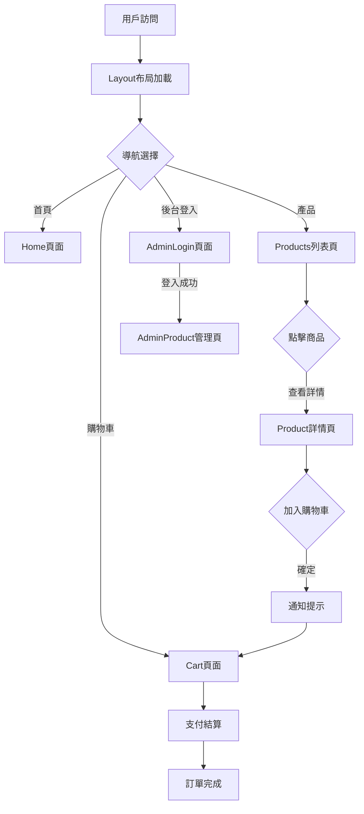
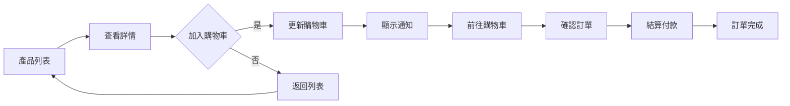
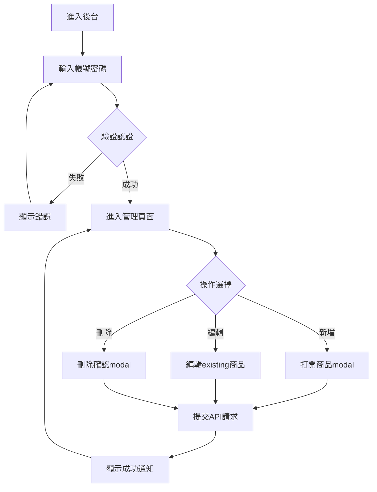
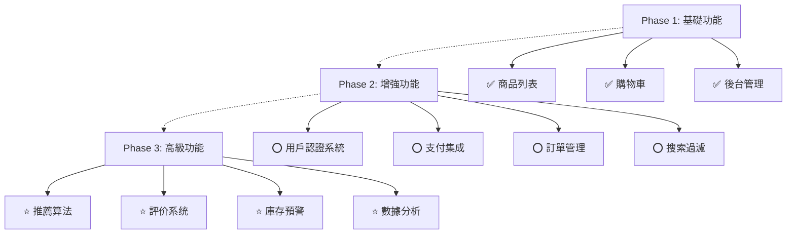

# 🛍️ Tech Choice 3C電子商務平台 - 專題發想文件

**專題名稱：** Tech Choice 3C電子商務  
**開發框架：** React + Vite  
**當前版本：** v0.0.0  
**最後更新：** 2026年2月12日

---

## 一、專題概述

### （一）專題簡介

Tech Choice 3C電子商務是一個現代化的線上購物平台，專門銷售3C電子產品。平台採用 **React 19** 和 **Vite** 構建，提供快速的用戶體驗和高效的開發流程。該專題具備完整的前端電商功能，包括商品展示、購物車管理、支付系統和後台管理功能。

### （二）核心特性

✅ **用戶功能**

- 商品列表瀏覽
- 商品詳情展示（含完整描述和規格）
- 購物車管理（新增、編輯數量、刪除）
- 訂單結算與付款流程
- 訂單追蹤與歷史查詢（可選）
- 用戶個人資料管理（可選）
- 收藏商品與比較功能（可選）

✅ **首頁區塊**（簡化易實作版本）

- **Hero Section**: 1-2張靜態推廣圖示 + 簡單文案（不需輪播）
- **分類導航**: 3-4個主要分類卡片（筆電、手機、平板、配件等）
- **精選商品**: 6-8個精選商品網格展示
- **簡單促銷**: 文字型優惠條件展示（如「滿額免運」「新會員折扣」）
- **CTA按鈕**: 「查看全部商品」導向商品列表

✅ **管理員功能**

- 商品CRUD操作（新增、編輯、刪除）
- 商品庫存管理（可選）
- 訂單管理與狀態更新（可選）
- 銷售報表與數據分析（可選）
- 用戶管理與權限控制（可選）

---

## 二、系統架構

### （一）技術

| 層次         | 技術棧               | 說明           |
| ------------ | -------------------- | -------------- |
| **前端框架** | React 19             | 核心UI框架     |
| **構建工具** | Vite 5               | 快速開發與打包 |
| **狀態管理** | Redux Toolkit        | 全局狀態管理   |
| **路由管理** | React Router 7       | 多頁面路由     |
| **表單處理** | React Hook Form 7    | 表單驗證       |
| **UI框架**   | Bootstrap 5          | 響應式設計     |
| **HTTP請求** | Axios                | API通訊        |
| **加載動畫** | React Loader Spinner | 用戶體驗       |
| **樣式**     | SCSS                 | 進階CSS        |

### （二）專題結構圖

```
react-week5/
├── src/
│   ├── Layout.jsx              (主應用布局)
│   ├── main.jsx                (入口文件)
│   ├── component/              (通用組件)
│   │   ├── DeleteModal.jsx      (刪除確認modal)
│   │   ├── Loading.jsx          (加載指示器)
│   │   ├── Notification.jsx     (通知提示)
│   │   ├── Pagination.jsx       (分頁組件)
│   │   └── ProductModal.jsx     (商品編輯modal)
│   ├── views/                  (頁面視圖)
│   │   ├── Home.jsx            (首頁)
│   │   ├── Products.jsx        (商品列表)
│   │   ├── Product.jsx         (商品詳情)
│   │   ├── Cart.jsx            (購物車)
│   │   ├── AdminLogin.jsx      (管理員登入)
│   │   ├── AdminProduct.jsx    (商品管理)
│   │   └── NotFound.jsx        (404頁面)
│   ├── routes/
│   │   └── index.jsx           (路由配置)
│   ├── context/                (Context API)
│   │   └── LoadingContext.jsx  (加載狀態)
│   ├── hooks/                  (自定義hooks)
│   │   └── useNotification.js  (通知hook)
│   ├── store/                  (Redux配置)
│   │   ├── index.js            (store配置)
│   │   └── notificationSlice.js(通知狀態切片)
│   └── scss/                   (樣式文件)
│       ├── all.scss            (全局樣式)
│       ├── loading.scss        (加載樣式)
│       └── notification.scss   (通知樣式)
├── index.html                  (HTML模板)
├── package.json                (依賴配置)
├── vite.config.js              (Vite配置)
└── eslint.config.js            (ESLint配置)
```

---

## 三、用戶流程圖

### （一）整體應用流程



### （二）購物流程



### （三）管理員流程



---

## 四、專題審核標準與檢核點

### （一）基礎檢核點（必須符合）

#### 1. 提交檔案格式要求

✅ **必須提供**

- 前台 Github Repository（含完整代碼）
- 後台 Github Repository（連結或在同一 Repo）
- GitHub Pages（部署站點，需正常開啟）
- `.env` 配置文件（便於助教本地測試）

✅ **代碼品質要求**

- 無 ESLint 錯誤（必須通過 lint 檢查）
- GitHub Repo 中不包含 `node_modules` 資料夾
- 作品能在本地環境正常開啟
- GitHub Pages 部署成功且可正常訪問

✅ **認證信息**

- 若有後台登入，需提供測試帳號密碼
- 若使用六角電商 API，確保 API Path 是自己的

---

#### 2. 版面與 RWD 規範

✅ **前台（需支持 RWD）**

- 最小寬度：375px（手機尺寸）
- 最大寬度：1920px（桌面尺寸）
- **不能出現橫向滾動軸（X軸）**
- 各尺寸下無破版、跑版現象
- 響應式設計在各斷點處理合理

✅ **後台（以 1920px 為標準）**

- 1920px 尺寸下不可出現 X軸
- Table 导致的 responsive X軸可接受
- 後台通常無需全尺寸 RWD

---

#### 3. 文案與內容呈現

✅ **嚴禁內容**

- ❌ 不能有假文字（Lorem ipsum）
- ❌ 不能只有短短一行文案（如「這是產品」）
- ❌ 缺少完整描述和介紹

✅ **文案要求**

- 各頁面需有完整文案
- 產品需包含：名稱、圖片、介紹、價格、其他說明
- 可使用 ChatGPT 協助生成文案
- 描述應具有實際意義和說服力

---

### （二）審核成功標準（需同時滿足以下 2 項）

#### 1. 內容豐富度（必須達成）

✅ **首頁設計**

- Header 和 Footer 之外
- 至少需要 **4-5 個區塊**
- 例如：Banner、分類導航、熱銷商品、促銷活動、新品推薦

✅ **整體頁面架構**

- 至少需要 **5 個完整頁面**
- 前台頁面：首頁、商品列表、商品詳情、購物車、結帳頁面
- 後台頁面：登入、商品管理、訂單管理等

✅ **商品內容要求（電商主題）**

- **商品數量 ≥ 10 個**
- 每個商品需包含：
  - 商品名稱和圖片
  - 詳細描述（最少 50 字以上）
  - 價格與規格
  - 庫存狀態
  - 相關推薦或說明

✅ **主流程完整（必須完成）**

- **完整的購物流程：** 瀏覽商品 → 加入購物車 → 確認訂單 → 結帳完成
- 流程中每一步都需要正確的狀態反饋（通知提示、驗證等）

---

#### 2. 程式碼檢核修改幅度（需要達成）

✅ **技術要求**

- 必須使用 **React 開發**（使用 Vue 則無法進行代碼批改）
- 使用 React 19 + Vite（符合當前專題配置）

✅ **程式修改建議**

- 助教會提供程式碼相關建議
- **審核通過要求：修改建議 ≤ 2 個**（少於 3 個即可通過）
- 建議涉及範圍：
  - 代碼結構與組件設計
  - 狀態管理最佳實踐
  - 性能優化建議
  - 代碼規範與可讀性

---

### 📊 內容豐富度檢核清單

| 專題內容       | 要求           | 檢查項                           | 狀態 |
| -------------- | -------------- | -------------------------------- | ---- |
| **首頁區塊數** | 4-5 個         | Header、Footer、4-5 個內容區     | ⭕   |
| **頁面數量**   | ≥ 5 頁         | 首、商品列表、詳情、購物車、結帳 | ⭕   |
| **商品數量**   | ≥ 10 個        | 完整商品數據                     | ⭕   |
| **商品文案**   | 完整描述       | 名稱、圖片、介紹、價格、規格     | ⭕   |
| **主流程完成** | 購物→結帳      | 完整訂單流程                     | ⭕   |
| **RWD 適配**   | 375-1920px     | 無 X軸，無破版                   | ⭕   |
| **代碼質量**   | 無 ESLint 錯誤 | 通過所有檢查                     | ⭕   |
| **修改建議**   | ≤ 2 個         | 成功實施所有建議                 | ⭕   |

## 🚀 延伸功能規劃

### Phase 1：必須功能（審核基礎）

為了通過第八次作業審核，**必須完成以下核心功能：**

```
✅ 必須實現的 MVP 功能
├── 首頁設計（4-5個區塊）
├── 商品列表頁（分頁、≥10個商品數據）
├── 商品詳情頁（完整文案：名稱、圖片、介紹、價格、規格）
├── 購物車功能（新增、編輯數量、刪除、計算總額）
├── 結帳流程（訂單確認、支付方式、完成提示）
├── 後台管理（商品 CRUD、訂單查看）
├── 後台登入（帳號密碼認證）
├── 全局通知系統（操作反饋）
├── 加載狀態管理（API 請求反饋）
└── RWD 響應式設計（375px-1920px，無 X 軸）
```

**預估工時：** 40-60 小時

### Phase 2：增強功能

以下為審核通過後可選的增強功能，用於進一步提升用戶體驗和平台功能。

### 功能優先級圖表



**說明：** Phase 1 為通過審核所需的最小功能，Phase 2 和 Phase 3 為後續優化和增強方向

---

### Phase 2 建議新增功能

#### 🔐 **1. 用戶認證系統**

- 用戶註冊/登入（替代當前簡單登入）
- 密碼加密與驗證
- Token-based認證
- 個人資料管理
- 地址簿管理

**實現難度：** ⭐⭐⭐  
**預估工時：** 16小時

---

#### 💳 **2. 支付系統集成**

- 第三方支付API集成（綠界、金流）
- 訂單金額計算
- 發票管理
- 支付歷史記錄

**實現難度：** ⭐⭐⭐⭐  
**預估工時：** 24小時

---

#### 📊 **3. 訂單管理系統**

- 訂單追蹤
- 訂單狀態管理（待確認、已出貨、已送達）
- 取消/退貨流程
- 訂單查詢
- 發票下載

**實現難度：** ⭐⭐⭐  
**預估工時：** 20小時

---

#### 🔍 **4. 搜索與過濾功能**

- 全文搜索
- 分類篩選
- 價格範圍篩選
- 排序功能（價格、熱度、新品）
- 搜索歷史

**實現難度：** ⭐⭐⭐  
**預估工時：** 12小時

---

#### ⭐ **5. 評分與評價系統**

- 商品評價發表
- 評分統計
- 評價展示
- 評價管理（Admin）
- 虛假評價檢測

**實現難度：** ⭐⭐⭐  
**預估工時：** 18小時

---

#### 📱 **6. 移動端優化**

- 響應式設計加強
- 移動菜單
- Touch事件優化
- PWA支持
- 離線緩存

**實現難度：** ⭐⭐⭐  
**預估工時：** 14小時

---

#### 📈 **7. 後台分析面板**

- 銷售額統計
- 商品銷量排行
- 用戶數據分析
- 流量分析
- 圖表可視化（Chart.js）

**實現難度：** ⭐⭐⭐  
**預估工時：** 16小時

---

#### 💌 **8. 購物車增強**

- 購物車本地存儲
- 商品收藏夾
- 拼團購買
- 優惠券應用
- 購物車分享

**實現難度：** ⭐⭐  
**預估工時：** 10小時

---

#### 🎁 **9. 優惠與促銷**

- 折扣碼系統
- 優惠券管理
- 限時優惠
- 買一送一
- 會員級別制度

**實現難度：** ⭐⭐⭐⭐  
**預估工時：** 22小時

---

#### 📧 **10. 通知增強**

- Email通知
- SMS提醒
- Push通知
- 訂閱管理
- 通知歷史記錄

**實現難度：** ⭐⭐  
**預估工時：** 12小時

---

## 🎨 UI/UX 改進方案

### 設計原則

- 現代扁平化設計
- 深色模式支持
- 無障礙設計（A11y）
- 微互動效果
- 速度優化

### 建議改進

1. **首頁優化**
   - 輪播廣告
   - 熱銷商品展示
   - 分類導航展示
   - 新品推薦

2. **商品詳情頁**
   - 圖片預覽（Zoom效果）
   - 規格選擇器
   - 庫存顯示
   - 相關商品推薦

3. **購物車頁面**
   - 優惠券輸入
   - 配送方式選擇
   - 價格明細表
   - 安全提示

4. **結帳流程**
   - 多步驟表單
   - 進度指示器
   - 信息確認頁面
   - 支付方式選擇

## 📚 相關資源

### 文檔與工具

- [React官方文檔](https://react.dev)
- [Vite官方文檔](https://vitejs.dev)
- [Redux Toolkit](https://redux-toolkit.js.org)
- [React Router](https://reactrouter.com)

### 類似平台參考

- Amazon
- eBay
- Shopify
- MOMO購物

---

## 📋 最終專題提交檢查清單

在提交作業前，請確保已完成以下所有檢查：

### ✅ 基礎檢核點

- [ ] 創建前台 Github Repository（包含完整源代碼）
- [ ] 創建後台 Github Repository（如分開）或合併在同一 Repo
- [ ] 部署 GitHub Pages（測試可正常訪問）
- [ ] 配置 `.env` 文件（包含必要的 API 配置）
- [ ] 運行 `npm run build` 無錯誤
- [ ] 運行 `npm run lint` 無 ESLint 錯誤
- [ ] 刪除或忽略 `node_modules` 文件夾
- [ ] 本地開啟應用正常運行
- [ ] 準備後台登入帳號密碼（如需要）

### ✅ 內容豐富度檢核

- [ ] **首頁：** 包含 Header、Footer、以及 4-5 個信息區塊
- [ ] **頁面數量：** 至少 5 個完整頁面
- [ ] **商品數量：** 至少 10 個商品（含完整數據）
- [ ] **商品信息：** 名稱、圖片、詳細描述（≥50字）、價格、規格
- [ ] **無假文字：** 所有文案都是真實內容，無 Lorem ipsum
- [ ] **主流程完成：** 瀏覽商品 → 加入購物車 → 確認訂單 → 結帳完成

### ✅ 版面與 RWD 檢核

- [ ] 前台響應式設計正常（375px - 1920px）
- [ ] 前台最小寬度 375px 無 X 軸和破版
- [ ] 後台 1920px 寬度無 X 軸
- [ ] 使用 Bootstrap 或其他 RWD 框架
- [ ] 各斷點設計合理

### ✅ 程式碼質量檢核

- [ ] 使用 React 開發（非 Vue）
- [ ] 無 ESLint 錯誤或警告
- [ ] 代碼結構清晰、組件化設計
- [ ] 有效利用 Redux Toolkit 進行狀態管理
- [ ] 合理使用 hooks 和自定義 hooks

---

## 📝 提交計畫表

| 檢查內容         | 完成狀態 | 備註                    |
| ---------------- | -------- | ----------------------- |
| GitHub 前台 Repo | ⭕       | URL: **\*\***\_**\*\*** |
| GitHub 後台 Repo | ⭕       | URL: **\*\***\_**\*\*** |
| GitHub Pages     | ⭕       | URL: **\*\***\_**\*\*** |
| .env 文件        | ⭕       | 已準備                  |
| 首頁設計         | ⭕       | 5 個區塊                |
| 頁面數量         | ⭕       | 5+ 頁面                 |
| 商品數據         | ⭕       | 10+ 商品                |
| RWD 適配         | ⭕       | 375-1920px              |
| ESLint 檢查      | ⭕       | 無錯誤                  |
| 主流程完成       | ⭕       | 購物→結帳               |

---

**文件版本：** v2.0  
**最後修改：** 2026年2月12日  
**負責人：** 李維哲

- 以上內容由AI提供建議，預計二月底至三月初繳交專題初稿，上述計畫將視實際情形調整。
